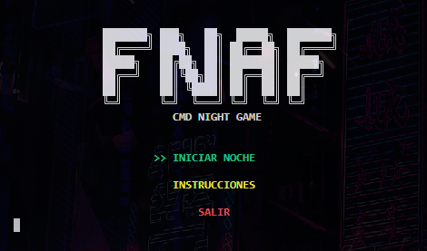

<p align="center">
  
</p>

<h1 align="center">FNAF: Signal Lost</h1>

---

<p align="center">
  Bienvenido a <strong>FNAF: Signal Lost</strong> — una emocionante experiencia de horror totalmente jugable en consola, inspirada en el universo de Five Nights at Freddy's.  
  Navega cámaras, administra la energía y sobrevive la noche… todo desde tu terminal.
</p>

<p align="center">
  
  
  
  
  
  
  
</p>


<br>

<p align="center">
  <a href="https://github.com/ZomboySoul/fnaf_signal_lost/issues/new?assignees=&labels=bug&projects=&template=bug_report.yml" target="_blank" rel="noopener noreferrer">Reportar Bug</a>
</p>
<p align="center">
  <a href="docs/README_fr.md">Français</a> ·  
  <a href="docs/README_cn.md">简体中文</a> ·
  <a href="docs/README_es.md">Español</a> ·
  <a href="docs/README_ja.md">日本語</a> ·
  <a href="docs/README_pt-BR.md">Português Brasileiro</a> ·
  <a href="docs/README_it.md">Italiano</a>
</p>

<br>

## 🧠 Características clave

- 🔦 **Sistema de energía**: limitado por el uso de cámaras y linterna.
- 🎥 **Mapa de cámaras interactivo** (navegación con teclas de flecha).
- 🤖 **IA de los animatrónicos** con dificultad ajustable.
- ⏰ **Reloj nocturno** que avanza con el tiempo.
- 🎶 **Efectos de sonido realistas** usando `pygame`.
- 💀 **Pantalla de Game Over personalizada**.
- 🌙 Niveles de dificultad: Normal, Difícil, Pesadilla.

---

## 🎮 Cómo jugar

```bash
# Clona el repositorio
git clone https://github.com/zomboysoul/fnaf_cmd_game.git
cd fnaf_cmd_game

# Ejecuta el juego (asegúrate de tener Python 3.10+)
python main.py
```

### 🕹️ Controles

- `↑ ↓ ← →`: Moverse entre cámaras
- `Enter`: Ver habitación seleccionada
- `F`:  Usar linterna
- `Q`: Salir del Juego

---

## 📁 Estructura del Proyecto

```bash
.
├── core/
│   ├── config.py
│   ├── energy.py
│   ├── game_engine.py
│   ├── movement.py
│   └── timers.py
├── ui/
│   └── screens.py
├── utils/
│   └── utils.py
├── rooms/
│   └── CAM_0X/ (plantillas ASCII de cámaras)
├── sounds/
│   └── *.mp3 (efectos de sonido)
├── animatronics.py
├── main.py
└── README.md
```

---

## ⚙️ Requirements

- Python 3.10 or later
- Pygame
- Colorama

Install them with:

```bash
pip install pygame colorama
```

---

## 📸 Capturas de pantalla




---

## 🧑‍💻 Autor

**Agustín Lezcano - ZomboySoul**
🔗 [GitHub](https://github.com/ZomboySoul) | 🇦🇷 Argentina
