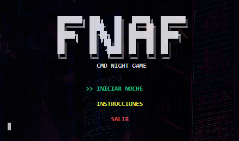
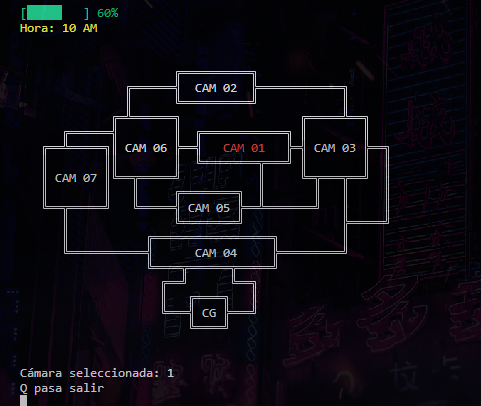
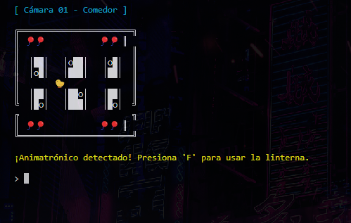

<p align="center">
  
</p>

<h1 align="center">FNAF: Signal Lost</h1>

---

<p align="center">
  Benvenuto in <strong>FNAF: Signal Lost</strong> — un’esperienza horror avvincente, completamente giocabile da console, ispirata all’universo di Five Nights at Freddy's.  
  Naviga tra le telecamere, gestisci l’energia e sopravvivi alla notte… tutto dal tuo terminale.
</p>

<p align="center">
  
  
  
  
  
  
  
</p>

<br>

<p align="center">
  <a href="https://github.com/ZomboySoul/fnaf_signal_lost/issues/new?assignees=&labels=bug&projects=&template=bug_report.yml" target="_blank" rel="noopener noreferrer">
  Segnala bug
  </a>
</p>

<p align="center">
  <a href="/readme_fr.md">Français</a> ·  
  <a href="readme_cn.md">简体中文</a> ·
  <a href="readme_es.md">Español</a> ·
  <a href="readme_ja.md">日本語</a> ·
  <a href="readme_pt-BR.md">Português Brasileiro</a> ·
  <a href="readme_it.md">Italiano</a>
</p>

<br>

## 🧠 Funzionalità principali

- 🔦 **Sistema di energia**: limitato dall’uso di telecamere e torcia.
- 🎥 **Mappa interattiva delle telecamere** (navigazione con le frecce).
- 🤖 **IA degli animatronici** con difficoltà regolabile.
- ⏰ **Orologio notturno** che avanza nel tempo.
- 🎶 **Effetti sonori realistici** usando `pygame`.
- 💀 **Schermata di Game Over personalizzata**.
- 🌙 Livelli di difficoltà: Normale, Difficile, Incubo.

---

## 🎮 Come giocare

```bash
# Clona il repository
git clone https://github.com/zomboysoul/fnaf_cmd_game.git
cd fnaf_cmd_game

# Avvia il gioco (assicurati di avere Python 3.10+)
python main.py
```

### 🕹️ Controlli

- `↑ ↓ ← →`: Muoversi tra le telecamere
- `Enter`: Vedi la stanza selezionata
- `F`: Usa la torcia
- `Q`: Esci dal gioco

---

## 📁 Struttura del Progetto

```bash
├── core/
.
│   ├── config.py
│   ├── energy.py
│   ├── game_engine.py
│   ├── movement.py
│   └── timers.py
├── ui/
│   └── screens.py
├── utils/
│   └── utils.py
├── rooms/
│   └── CAM_0X/ (template ASCII delle telecamere)
├── sounds/
│   └── *.mp3 (effetti sonori)
├── animatronics.py
├── main.py
└── README.md
```

---

## ⚙️ Requisiti

- Python 3.10 o superiore
- Pygame
- Colorama

Installali con:

```bash
pip install pygame colorama
```

---

## 📸 schermata







---

## 🧑‍💻 autore

**Agustín Lezcano - ZomboySoul**
🔗 [GitHub](https://github.com/ZomboySoul) | 🇦🇷 Argentina
