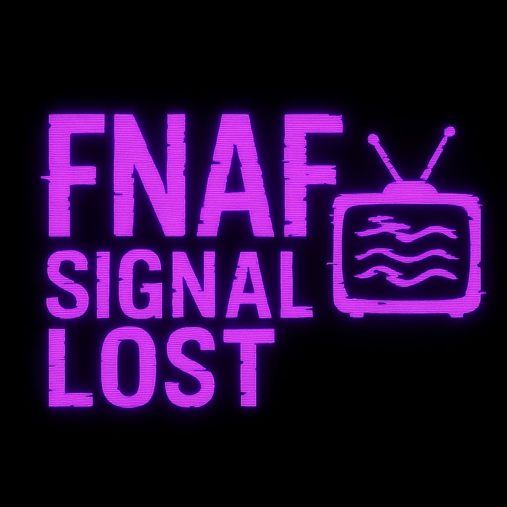
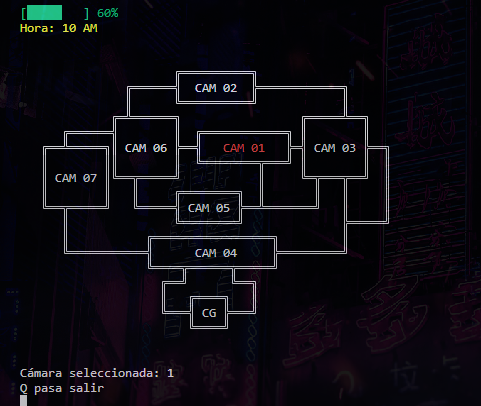

<p align="center">
  
</p>

<h1 align="center">FNAF: Signal Lost</h1>

---

<p align="center">
  <strong>FNAF: Signal Lost</strong>へようこそ — Five Nights at Freddy'sの世界観に触発された、コンソールで完全にプレイ可能なスリリングなホラー体験です。  
  カメラを操作し、電力を管理し、夜を生き延びましょう… すべてターミナルから。
</p>

<p align="center">
  
  
  
  
  
  
  
</p>

<br>

<p align="center">
  <a href="https://github.com/ZomboySoul/fnaf_signal_lost/issues/new?assignees=&labels=bug&projects=&template=bug_report.yml" target="_blank" rel="noopener noreferrer">
  バグを報告する
  </a>
</p>

<p align="center">
  <a href="./README_fr.md">Français</a> ·  
  <a href="./README_cn.md">简体中文</a> ·
  <a href="./README_es.md">Español</a> ·
  <a href="./README_ja.md">日本語</a> ·
  <a href="./README_pt-BR.md">Português Brasileiro</a> ·
  <a href="./README_it.md">Italiano</a>
</p>

<br>

## 🧠 主な機能

- 🔦 **エネルギーシステム**：カメラと懐中電灯の使用で制限。
- 🎥 **インタラクティブなカメラマップ**（矢印キーで操作）。
- 🤖 **アニマトロニクスのAI**、難易度調整可能。
- ⏰ **夜の時計**が時間と共に進行。
- 🎶 `pygame` を使用した**リアルな効果音**。
- 💀 **カスタムのゲームオーバー画面**。
- 🌙 難易度：ノーマル、ハード、ナイトメア。

---

## 🎮 プレイ方法

```bash
# リポジトリをクローン
git clone https://github.com/zomboysoul/fnaf_cmd_game.git
cd fnaf_cmd_game

# ゲームを実行（Python 3.10以上が必要）
python main.py
```

### 🕹️ 操作方法

- `↑ ↓ ← →`: カメラの切り替え
- `Enter`: 選択した部屋を見る
- `F`: 懐中電灯を使う
- `Q`: ゲームを終了

---

## 📁 プロジェクト構成

```bash
├── core/
.
│   ├── config.py
│   ├── energy.py
│   ├── game_engine.py
│   ├── movement.py
│   └── timers.py
├── ui/
│   └── screens.py
├── utils/
│   └── utils.py
├── rooms/
│   └── CAM_0X/ (カメラの ASCII アートテンプレート)
├── sounds/
│   └── *.mp3 (効果音)
├── animatronics.py
├── main.py
└── README.md
```

---

## ⚙️ 必要条件

- Python 3.10 以上
- Pygame
- Colorama

以下のコマンドでインストールできます：

```bash
pip install pygame colorama
```

---

## 📸 画面





---

## 🧑‍💻 著者

**Agustín Lezcano - ZomboySoul**
🔗 [GitHub](https://github.com/ZomboySoul) | 🇦🇷 アルゼンチン
