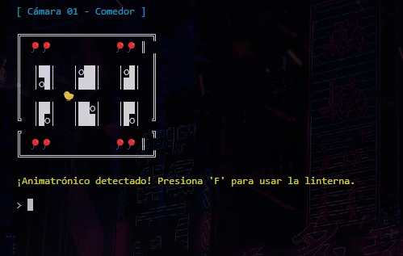

<p align="center">
  
</p>

<h1 align="center">FNAF: Signal Lost</h1>

---

<p align="center">
  Bienvenue dans <strong>FNAF: Signal Lost</strong> — une expérience d’horreur palpitante, entièrement jouable en console, inspirée de l’univers de Five Nights at Freddy's.  
  Naviguez dans les caméras, gérez l’énergie et survivez à la nuit… tout depuis votre terminal.
</p>


<p align="center">
  
  
  
  
  
  
  
</p>

<br>

<p align="center">
  <a href="https://github.com/ZomboySoul/fnaf_signal_lost/issues/new?assignees=&labels=bug&projects=&template=bug_report.yml" target="_blank" rel="noopener noreferrer">signaler un bug</a>
</p>

<p align="center">
  <a href="./README_fr.md">Français</a> ·  
  <a href="./README_cn.md">简体中文</a> ·
  <a href="./README_es.md">Español</a> ·
  <a href="./README_ja.md">日本語</a> ·
  <a href="./README_pt-BR.md">Português Brasileiro</a> ·
  <a href="./README_it.md">Italiano</a>
</p>

<br>

## 🧠 Fonctionnalités principales

- 🔦 **Système d'énergie** : limité par l'utilisation de la caméra et de la lampe torche.
- 🎥 **Carte de caméras interactive** (navigation avec les flèches du clavier).
- 🤖 **IA des animatroniques** avec difficulté ajustable.
- ⏰ **Horloge nocturne** qui avance avec le temps.
- 🎶 **Effets sonores réalistes** avec `pygame`.
- 💀 **Écran de Game Over personnalisé**.
- 🌙 Niveaux de difficulté : Normal, Difficile, Cauchemar.

---

## 🎮 Comment jouer

```bash
# Cloner le dépôt
git clone https://github.com/zomboysoul/fnaf_cmd_game.git
cd fnaf_cmd_game

# Lancer le jeu (assurez-vous d’avoir Python 3.10+)
python main.py
```

### 🕹️ Contrôles

- `↑ ↓ ← →`: Se déplacer entre les caméras
- `Enter`: Voir la pièce sélectionnée
- `F`:  Utiliser la lampe torche
- `Q`: Quitter le jeu

---

## 📁 Structure du projet

```bash
├── core/
.
│   ├── config.py
│   ├── energy.py
│   ├── game_engine.py
│   ├── movement.py
│   └── timers.py
├── ui/
│   └── screens.py
├── utils/
│   └── utils.py
├── rooms/
│   └── CAM_0X/ (modèles ASCII des caméras)
├── sounds/
│   └── *.mp3 (effets sonores)
├── animatronics.py
├── main.py
└── README.md
```

---

## ⚙️ effets sonores

- Python 3.10 ou version ultérieure
- Pygame
- Colorama

Installez-les avec :

```bash
pip install pygame colorama
```

---

## 📸 capture d'écran




---

## 🧑‍💻 auteur

📄[Voir la documentation du projet](https://zomboysoul.github.io/fnaf_signal_lost/)
**Agustín Lezcano - ZomboySoul**
🔗 [GitHub](https://github.com/ZomboySoul) | 🇦🇷 Argentine
